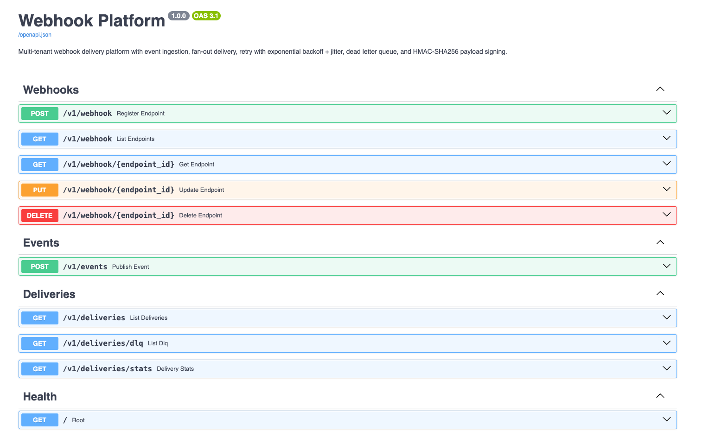
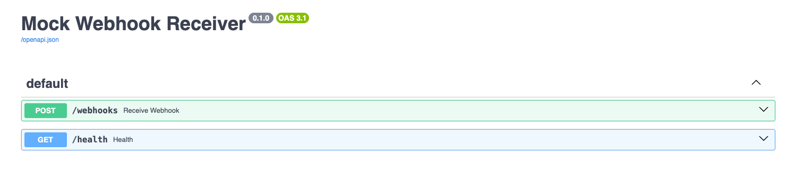

# Async Webhook Delivery System

A multi-tenant webhook delivery platform built with Python, FastAPI, Redis, and SQLAlchemy, designed to demonstrate event-driven backend architecture, asynchronous delivery, and reliability patterns.

## Project Highlights

- Event-driven webhook delivery with endpoint registration and fan-out
- Asynchronous workers with retry scheduling and DLQ handling
- HMAC-SHA256 signed payload delivery for receiver verification
- End-to-end local demo with mock webhook receiver

## Architecture

```
┌──────────────┐     ┌──────────┐     ┌──────────────────┐     ┌────────────────┐     ┌─────────────────┐     ┌─────────────────┐
│   Internal   │────▶│  Event   │────▶│    Ingestion     │────▶│   Delivery     │────▶│    Delivery     │────▶│    Client       │
│   Services   │     │  Queue   │     │    Service       │     │   Queue        │     │    Workers      │     │    Endpoints    │
└──────────────┘     └──────────┘     └──────────────────┘     └────────────────┘     └─────────────────┘     └─────────────────┘
                                             │                                               │
                                      ┌──────┴──────┐                                ┌──────┴──────┐
                                      │   DB +      │                                │  Retry      │
                                      │   Cache     │                                │  Storage    │
                                      └─────────────┘                                └──────┬──────┘
                                                                                            │
                                                                                     ┌──────┴──────┐
                                                                                     │    Task     │
                                                                                     │  Scheduler  │
                                                                                     └──────┬──────┘
                                                                                            │
                                                                                     ┌──────┴──────┐
                                                                                     │    DLQ      │
                                                                                     │ Dead Letter │
                                                                                     └─────────────┘
```

## Key Design Decisions

| Concern | Decision |
|---|---|
| **Decoupling** | Message queue between internal services and ingestion prevents cascading failures |
| **Delivery guarantee** | At-least-once delivery with asynchronous workers and persistent retry scheduling |
| **Retry strategy** | Exponential backoff with jitter to reduce repeated burst failures |
| **Authentication** | HMAC-SHA256 payload signing with a shared secret per endpoint |
| **Scalability** | Ingestion and delivery components are separated so they can scale independently |

## Example Flow

1. Register a webhook endpoint through `POST /v1/webhook`
2. Publish an event through `POST /v1/events`
3. The ingestion service enqueues delivery jobs
4. Delivery workers send signed payloads to subscribed endpoints
5. Failed deliveries are retried with exponential backoff
6. Exhausted retries are moved to the dead-letter queue

## Screenshots

### API Documentation


### Mock Webhook Receiver


## Quick Start

### With Docker (recommended)

```bash
docker compose up --build
```

This starts 5 services:
- **API server** → http://localhost:8000 (Swagger docs at `/docs`)
- **Delivery worker** — consumes queue, sends webhooks
- **Retry scheduler** — periodically re-enqueues failed deliveries
- **Redis** — message queue
- **Mock receiver** → http://localhost:9000 (simulated customer endpoint)

### Run the demo

```bash
# In another terminal:
pip install -r requirements.txt
python demo.py http://localhost:8000
```

### Without Docker (local dev)

```bash
# Terminal 1: Redis
redis-server

# Terminal 2: Mock receiver
pip install -r requirements.txt
python -m mock_receiver.server

# Terminal 3: API server
uvicorn app.main:app --reload --port 8000

# Terminal 4: Delivery worker
python -m app.workers.delivery_worker

# Terminal 5: Retry scheduler
python -m app.workers.retry_scheduler
```

## Project Structure

```
webhook-delivery-platform/
├── app/
│   ├── main.py                  # FastAPI application
│   ├── api/
│   │   ├── webhooks.py          # Endpoint CRUD (POST/PUT/DELETE /v1/webhook)
│   │   ├── events.py            # Event ingestion (POST /v1/events)
│   │   └── deliveries.py        # Delivery logs & DLQ (GET /v1/deliveries)
│   ├── services/
│   │   ├── registration_service.py   # Endpoint management logic
│   │   ├── ingestion_service.py      # Event → queue fan-out
│   │   ├── delivery_service.py       # HTTP delivery + retry + DLQ
│   │   └── signing_service.py        # HMAC-SHA256 signing & verification
│   ├── workers/
│   │   ├── delivery_worker.py   # Queue consumer → sends webhooks
│   │   └── retry_scheduler.py   # Periodic scan → re-enqueue due retries
│   ├── db/
│   │   ├── database.py          # SQLAlchemy engine & session
│   │   └── models.py            # 3 tables: endpoints, attempts, DLQ
│   ├── schemas/                 # Pydantic request/response models
│   └── core/
│       └── config.py            # Environment-based configuration
├── mock_receiver/
│   └── server.py                # Simulated customer endpoint (configurable failure rate)
├── tests/
│   └── test_platform.py         # Unit tests for signing, API, and delivery
├── demo.py                      # End-to-end demo script
├── docker-compose.yml           # Full stack: API + worker + scheduler + Redis + receiver
├── Dockerfile
├── requirements.txt
└── README.md
```

## API Reference

### Webhook Endpoints

| Method | Path | Description |
|---|---|---|
| `POST` | `/v1/webhook` | Register a new endpoint |
| `GET` | `/v1/webhook` | List all endpoints |
| `GET` | `/v1/webhook/{endpoint_id}` | Get endpoint details |
| `PUT` | `/v1/webhook/{endpoint_id}` | Update endpoint URL or status |
| `DELETE` | `/v1/webhook/{endpoint_id}` | Delete an endpoint |

### Events

| Method | Path | Description |
|---|---|---|
| `POST` | `/v1/events` | Publish an event (simulates internal service) |

### Deliveries

| Method | Path | Description |
|---|---|---|
| `GET` | `/v1/deliveries` | List delivery attempts (filter by event_id, endpoint_id, status) |
| `GET` | `/v1/deliveries/dlq` | List Dead Letter Queue entries |
| `GET` | `/v1/deliveries/stats` | Delivery statistics |

## Retry Strategy

```
Attempt 1  ─── fail ──▶  100ms + jitter
Attempt 2  ─── fail ──▶  200ms + jitter
Attempt 3  ─── fail ──▶  400ms + jitter
Attempt 4  ─── fail ──▶  800ms + jitter
Attempt 5  ─── fail ──▶  Persist to retry storage
                              │
                    ┌─────────┴──────────┐
                    │  Task Scheduler    │
                    │  (every 60s scan)  │
                    └─────────┬──────────┘
                              │
                    Re-enqueue: 15min, 30min, 1h, 2h, 4h...
                              │
                    Within SLA (72h)? ──▶ retry
                    Exceeded SLA?     ──▶ Dead Letter Queue
```

## Tests

```bash
pytest tests/ -v
```

## Tech Stack

- **Python 3.12** + **FastAPI**
- **SQLAlchemy + SQLite** for local development
- **Redis** for queue-based asynchronous processing
- **HMAC-SHA256** for payload authentication
- **Docker Compose** for multi-service orchestration
